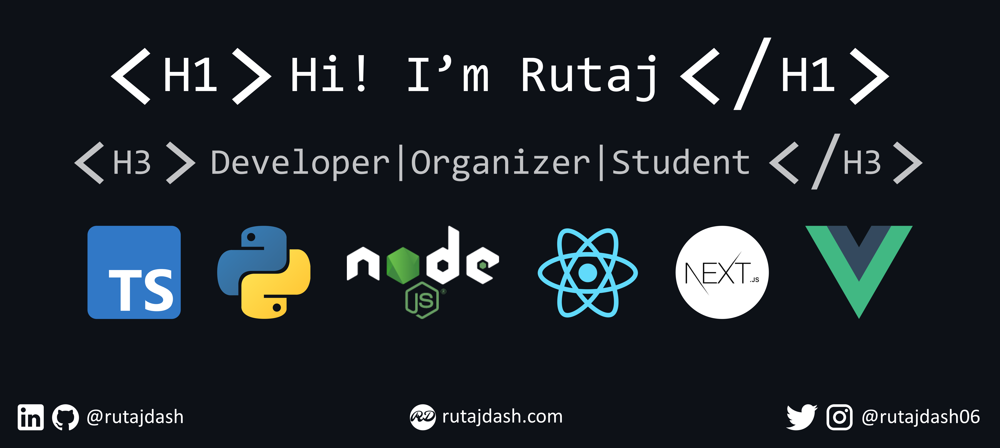

## About Me

I'm a passionate self-taught full-stack and mobile application developr from India.

- From Bhubaneswar, Odisha, India
- A pre-final year student of [NIT Rourkela](https://nitrkl.ac.in)
- Currently working on [Project Vormir](https://github.com/coep-astronomy/project-vormir)
- Learning TypeScript and Next.js
- An avid supporter of open source development
- Always open to opportunity and collaborations
- Most experience in Node.js and Apollo GraphQL

## What I Work With

### At present

- Frameworks, Libraries and Languages:

- Hosting, Cloud and Server Platforms:

### In the past

- Frameworks, Libraries and Languages:

- Hosting, Cloud and Server Platforms:

### [The Full List](profile/TECH.md)

## How To Reach Me

## My Stats

